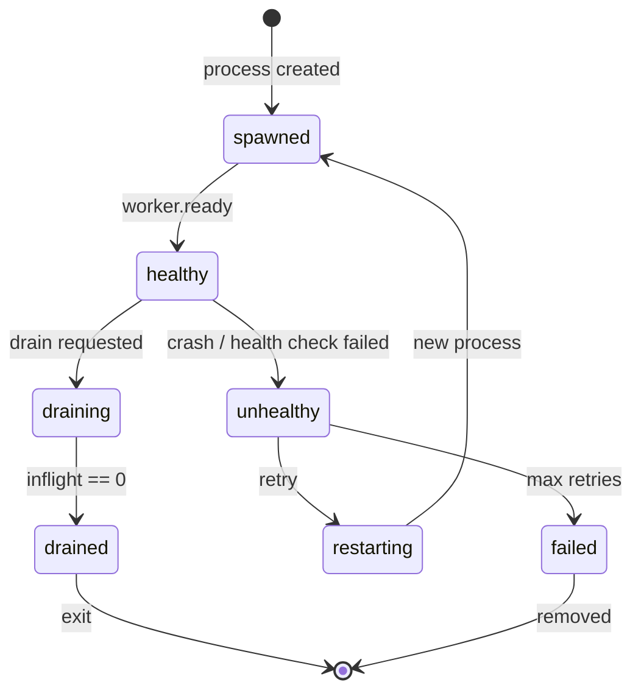

# L0 Worker


Stateless, deterministic execution substrate for LLM inference. Receives commands from L1 orchestrator, executes tasks using the L0 runtime, and emits factual events back.

## 📖 Overview

L0 Worker is a serverless-first execution layer that:

- 📥 Receives task submissions via HTTP/SSE
- 🤖 Executes LLM inference using `@ai2070/l0` + Vercel AI SDK
- 📡 Streams events back to L1 orchestrator
- 🔇 Enforces backpressure by silence (no `TASK_ACCEPTED` = rejection)
- 🔁 Supports deterministic replay of recorded events
- 🛡️ Guardrails, timeouts, and token resumption via L0 runtime
- 🔧 Schema-only tool definitions for model tool calling
- ⚡ Parallel execution (race / fanout) across multiple models

## 🛠️ Stack

- **Runtime:** Bun / Node.js + TypeScript
- **Inference:** `@ai2070/l0` (streaming runtime, retry, fallbacks, guardrails)
- **Providers:** `ai` + `@ai-sdk/openai` (OpenAI only)
- **Validation:** Zod
- **Deployment:** Bun standalone server or Vercel Serverless Functions

## 📦 Installation

```bash
npm install
```

## 💻 Development

```bash
# Standalone Bun server (default port 3000)
npm run dev

# Vercel local development
npm run dev:vercel

# Type checking
npm run lint

# Build
npm run build
```

## 🌐 API Endpoints

### POST /api/submit

Submit a task for execution. Returns streaming SSE response with events. Duplicate `task_id` submissions are rejected while the original is in-flight.

```bash
curl -X POST http://localhost:3000/api/submit \
  -H "Content-Type: application/json" \
  -d '{
    "type": "TASK_SUBMIT",
    "auth": {
      "token": "K7gNU3sdo+OL0wNhqoVWhr3g6s1xYv72ol/pe/Unols=",
      "issued_at": 1702900000000,
      "ttl": 30000
    },
    "task_id": "task-123",
    "order": {
      "execution": {
        "models": [{ "provider": "openai", "model": "gpt-4o" }]
      },
      "output": { "kind": "text" }
    },
    "payload": { "prompt": "Hello, world!" },
    "input_hash": "sha256:...",
    "submission_ts": 1702900000000
  }'
```

### POST /api/replay

Replay recorded events for a task. Does NOT re-execute - only re-emits previously recorded events. Optionally validates output hash for integrity checking.

```bash
curl -X POST http://localhost:3000/api/replay \
  -H "Content-Type: application/json" \
  -d '{
    "type": "TASK_REPLAY_REQUEST",
    "auth": { "token": "...", "issued_at": ..., "ttl": 30000 },
    "task_id": "task-123",
    "input_hash": "sha256:...",
    "expected_output_hash": "sha256:...",
    "reason": "verification",
    "replay_ts": 1702900000000
  }'
```

Response includes `events_replayed` count and `output_hash_match` (boolean or null if no expected hash provided).

### GET /api/status

Get worker status.

```bash
curl http://localhost:3000/api/status
```

### POST /api/config

Update worker configuration (hot reload). No auth required from localhost.

```bash
curl -X POST http://localhost:3000/api/config \
  -H "Content-Type: application/json" \
  -d '{
    "type": "WORKER_CONFIG_UPDATE",
    "worker_id": "...",
    "max_concurrency": 2,
    "effective_ts": 1702900000000
  }'
```

### POST /api/drain

Trigger graceful shutdown. Used by supervisor for cross-platform graceful shutdown.

- **Localhost**: No auth required
- **Non-localhost**: Requires valid auth token

```bash
# From localhost (no auth needed)
curl -X POST http://localhost:3000/api/drain

# From remote (auth required)
curl -X POST http://worker-host:3000/api/drain \
  -H "Content-Type: application/json" \
  -d '{
    "worker_id": "...",
    "auth": {
      "token": "...",
      "issued_at": 1702900000000,
      "ttl": 30000
    }
  }'
```

Response:
```json
{
  "success": true,
  "message": "Drain initiated",
  "workerId": "...",
  "drainBufferMs": 5000
}
```

The worker will emit `worker.draining` event and exit after `drainBufferMs` milliseconds.

## 📋 Inference Order

Every task submission requires an `order` that defines execution and output contract:

```typescript
{
  "order": {
    "execution": {
      "models": [
        { "provider": "openai", "model": "gpt-4o", "params": { "temperature": 0.7 } }
      ],
      "retry": {
        "attempts": 3,
        "maxRetries": 6,
        "backoff": "exponential",
        "baseDelayMs": 1000
      },
      "fallbacks": [
        { "when": "error", "model": { "provider": "openai", "model": "gpt-4o-mini" } }
      ],
      "timeout": {
        "initialTokenMs": 10000,
        "interTokenMs": 5000
      },
      "guardrails": {
        "preset": "recommended",
        "checkIntervalMs": 500
      },
      "tools": [
        {
          "name": "get_weather",
          "description": "Get current weather for a city",
          "schema": { "type": "object", "properties": { "city": { "type": "string" } }, "required": ["city"] }
        }
      ],
      "parallel": { "mode": "race" },
      "continueFromLastKnownGoodToken": true
    },
    "output": {
      "kind": "json",
      "schema": { "type": "object", "properties": { "name": { "type": "string" } } },
      "strict": true
    }
  }
}
```

### Output Kinds

| Kind | Description |
|------|-------------|
| `text` | Raw text stream |
| `json` | Structured JSON with schema validation |

### Timeouts

Per-stream timeout configuration passed to the L0 runtime:

| Field | Description |
|-------|-------------|
| `initialTokenMs` | Max time to wait for the first token |
| `interTokenMs` | Max time between consecutive tokens |

Timeouts trigger L0's `TIMEOUT_TRIGGERED` event and may cause retry or fallback depending on configuration. Critical for serverless deployments where idle time costs money.

### Guardrails

Guardrails validate output quality during streaming. Specify a preset name and optional check interval:

| Preset | Description |
|--------|-------------|
| `minimal` | Zero-output detection only |
| `recommended` | JSON, Markdown, and zero-output checks |
| `strict` | All checks with strict JSON validation |
| `json-only` | JSON structure validation |
| `markdown-only` | Markdown structure validation |
| `latex-only` | LaTeX structure validation |

Guardrail violations emit `GUARDRAIL_PHASE_START` / `GUARDRAIL_PHASE_END` L0 events and are classified as `guardrail_violation` in `TASK_FAILED`.

### Tools

Tools are schema-only definitions passed to the model. The model generates tool call arguments which are captured in the result — the worker does **not** execute tools server-side.

Each tool requires a `name` and JSON Schema `schema`. An optional `description` helps the model decide when to use the tool. When a tool call is generated, a `TASK_PROGRESS` event with `stage: "tool_invoked"` is emitted.

### Parallel Execution

When `parallel` is specified, all models in the `models` array run simultaneously:

| Mode | Description |
|------|-------------|
| `race` | First model to complete wins; others are cancelled |
| `fanout` | All models run to completion; results returned as JSON array |

For `fanout`, an optional `max` field limits concurrency.

### Token Resumption

When `continueFromLastKnownGoodToken` is `true`, the L0 runtime checkpoints token progress and resumes from the last known good position on retry or fallback instead of restarting from scratch.

## 🔐 Authentication

Ephemeral, single-invocation auth with HMAC verification:

```typescript
{
  "auth": {
    "token": "HMAC-SHA256(secret, task_id|issued_at|ttl)",  // base64
    "issued_at": 1702900000000,  // Unix timestamp ms
    "ttl": 30000                  // Validity window ms
  }
}
```

**L1 generates tokens:**
```typescript
import { createHmac } from "node:crypto";

const payload = `${taskId}|${issuedAt}|${ttl}`;
const token = createHmac("sha256", L0_AUTH_SECRET)
  .update(payload, "utf8")
  .digest("base64");
```

- ✅ Token validated once per request via HMAC signature
- 🚫 Never stored, never reused
- ⏱️ Freshness check: `now - issued_at < ttl`
- 🕐 5-second clock skew tolerance
- 🔓 If `L0_AUTH_SECRET` is not set, signature verification is skipped (dev mode)

## 📤 Events

### Outbound (Worker → L1)

| Event | Description |
|-------|-------------|
| `WORKER_READY` | Worker initialized and accepting tasks |
| `TASK_ACCEPTED` | Task accepted for execution |
| `TASK_PROGRESS` | Milestone reached (`first_token`, `tool_invoked`) |
| `TASK_COMPLETED` | Execution succeeded with `finalMetrics` and `outputHash` |
| `TASK_FAILED` | Execution failed with `failureClass` and `retryable` flag |
| `WORKER_DRAINING` | Graceful shutdown in progress |

Failure classes: `timeout`, `rate_limited`, `context_length_exceeded`, `invalid_input`, `model_error`, `network_error`, `guardrail_violation`, `aborted`, `unknown`

### L0 Lifecycle Events

L0 runtime events are passed through directly to L1:

- `SESSION_START`, `SESSION_END`
- `RETRY_START`, `RETRY_ATTEMPT`, `RETRY_END`
- `FALLBACK_START`, `FALLBACK_END`
- `GUARDRAIL_PHASE_START`, `GUARDRAIL_PHASE_END`
- `TIMEOUT_TRIGGERED`, `NETWORK_ERROR`
- `TOOL_REQUESTED`, `TOOL_START`, `TOOL_RESULT`, `TOOL_COMPLETED`
- `CHECKPOINT_SAVED`, `RESUME_START`
- And more (see [API.md](./API.md))

## ⏸️ Backpressure

L0 enforces backpressure by silence:

1. `TASK_SUBMIT` arrives
2. Check slot availability and duplicate task ID
3. If available → emit `TASK_ACCEPTED`
4. If no slot → **silence** (L1 infers rejection)
5. If duplicate task ID → **silence**

No queue. No buffering. No rejection event.

## 🔁 Replay

Replay re-emits recorded facts. It does NOT re-execute.

Events are stored in an in-memory event store (lost on restart). The store supports optional FIFO eviction via `maxTasks` to bound memory usage.

Replay must **NEVER**:
- ❌ Regenerate tokens differently
- ❌ Re-invoke tools with side effects
- ❌ Fabricate progress events
- ❌ Emit events that weren't originally recorded

## ⚙️ Configuration

### Deployment Presets

The worker auto-detects deployment environment and applies appropriate defaults:

| Setting | Local | Vercel |
|---------|-------|--------|
| `maxConcurrency` | 64 | 1 |
| `functionTimeoutMs` | 0 (disabled) | 60000 (60s) |
| `drainBufferMs` | 5000 | 5000 |
| `skipAuthValidation` | true | false |

Preset is selected by:
- `DEPLOYMENT=vercel` env var, or
- `VERCEL` env var (auto-set by Vercel platform)

### Environment Variables

All variables override preset defaults:

| Variable | Description |
|----------|-------------|
| `WORKER_ID` | Worker identifier (default: uuidv7) |
| `PORT` | Standalone server port (default: 3000) |
| `MAX_CONCURRENCY` | Max concurrent tasks |
| `FUNCTION_TIMEOUT_MS` | Serverless timeout in ms (0 = disabled) |
| `DRAIN_BUFFER_MS` | Buffer before timeout to emit WORKER_DRAINING |
| `SKIP_AUTH_VALIDATION` | Skip HMAC auth (default: true for local) |
| `L0_AUTH_SECRET` | Shared secret for HMAC auth (required in production) |
| `OPENAI_API_KEY` | OpenAI API key |

## 🖥️ Supervisor (Multi-Worker Pool)

For running multiple workers with automatic health checking and crash recovery, use the Rust supervisor:

```bash
cd supervisor
cargo build --release

# Run 4 workers starting at port 3001
./target/release/l0-supervisor -w 4 -p 3001 ./path/to/l0-worker
```

### Supervisor Features

- **Process pool management** - Spawn and manage multiple worker processes
- **Health checking** - Periodic HTTP health checks via `/api/status`
- **Crash recovery** - Automatic restart with exponential backoff
- **Hung worker detection** - Kill and restart workers that fail consecutive health checks
- **Graceful shutdown** - Cross-platform via `/api/drain` endpoint
- **Pool status API** - Query worker states for L1 routing
- **Event streaming** - Pool lifecycle events for monitoring

### Supervisor API

The supervisor exposes a REST API for querying and controlling the worker pool.

#### GET /workers

List all workers.

```bash
curl http://localhost:9000/workers
```

Response:
```json
{
  "workers": [
    { "id": "l0-019400a1-2b3c-7def-8901-234567890abc", "port": 3001, "state": "healthy", "consecutive_failures": 0 },
    { "id": "l0-019400a1-2b3c-7def-8901-234567890abd", "port": 3002, "state": "healthy", "consecutive_failures": 0 }
  ],
  "healthy_count": 2,
  "total_count": 2
}
```

Worker states: `starting`, `healthy`, `draining`, `failed`, `stopped`

#### GET /workers/:id

Get a single worker's status.

```bash
curl http://localhost:9000/workers/l0-019400a1-2b3c-7def-8901-234567890abc
```

Response:
```json
{
  "id": "l0-019400a1-2b3c-7def-8901-234567890abc",
  "port": 3001,
  "state": "healthy",
  "consecutive_failures": 0
}
```

Returns 404 if the worker is not found.

#### GET /workers/events (SSE)

Real-time event stream for supervisor and worker lifecycle changes.

```bash
curl -N http://localhost:9000/workers/events
```

**Global Events:**
```
event: supervisor_ready
data: {"worker_count":4,"api_port":9000}

event: all_workers_healthy
data: {}

event: shutting_down
data: {}
```

**Per-Worker Events:**
```
event: worker_spawned
data: {"id":"l0-...","port":3001}

event: worker_healthy
data: {"id":"l0-...","port":3001}

event: worker_unhealthy
data: {"id":"l0-...","reason":"health check failed"}

event: worker_draining
data: {"id":"l0-..."}

event: worker_drained
data: {"id":"l0-..."}

event: worker_restarting
data: {"id":"l0-...","attempt":1}

event: worker_failed
data: {"id":"l0-..."}
```

**Event Lifecycle:**

Workers follow one of two mutually exclusive paths:



Key semantics:
- `worker_spawned`: Process created and registered (not yet healthy)
- `worker_healthy`: Worker is ready and accepting work
- `worker_draining`: Graceful shutdown initiated (no new work accepted)
- `worker_drained`: All inflight tasks completed (emitted before process exit)
- `worker_spawned` and `worker_healthy` are never merged
- `worker_drained` and `worker_failed` are mutually exclusive (different paths)

#### POST /workers/spawn

Spawn a new worker on the next available port.

```bash
curl -X POST http://localhost:9000/workers/spawn
```

Response:
```json
{ "id": "l0-019400a1-2b3c-7def-8901-234567890abe", "port": 3003 }
```

#### POST /workers/:id/drain

Gracefully drain a worker (sends shutdown signal, waits for in-flight requests).

```bash
curl -X POST http://localhost:9000/workers/l0-019400a1-2b3c-7def-8901-234567890abc/drain
```

Response:
```json
{
  "success": true,
  "message": "Worker l0-019400a1-2b3c-7def-8901-234567890abc drain initiated"
}
```

#### POST /workers/:id/kill

Force kill a worker immediately.

```bash
curl -X POST http://localhost:9000/workers/l0-019400a1-2b3c-7def-8901-234567890abc/kill
```

Response:
```json
{
  "success": true,
  "message": "Worker l0-019400a1-2b3c-7def-8901-234567890abc killed"
}
```

#### POST /workers/:id/restart

Restart a worker (drain + spawn new on same port).

```bash
curl -X POST http://localhost:9000/workers/l0-019400a1-2b3c-7def-8901-234567890abc/restart
```

Response:
```json
{ "id": "l0-019400a1-2b3c-7def-8901-234567890abf", "port": 3001 }
```

### Supervisor CLI Options

| Option | Description | Default |
|--------|-------------|---------|
| `-w, --workers` | Number of workers | CPU count |
| `-p, --base-port` | Starting port for workers | 3001 |
| `--max-port` | Maximum allowed port number | 49151 |
| `--api-port` | Supervisor API port | 9000 |
| `--health-interval` | Health check interval (ms) | 2000 |
| `--health-timeout` | Health check timeout (ms) | 2000 |
| `--restart-delay` | Initial restart delay (ms) | 500 |
| `--max-restart-delay` | Max restart delay (ms) | 30000 |
| `--max-failures` | Max consecutive failures before stopping | 5 |
| `--max-unhealthy-checks` | Max consecutive unhealthy checks before killing | 2 |
| `--shutdown-timeout` | Graceful shutdown timeout (ms) | 30000 |
| `--worker-binary` | Path to l0-worker binary | `./l0-worker` |
| `--log-level` | Log level (trace/debug/info/warn/error) | info |

### Building the Supervisor

```bash
cd supervisor
cargo build --release
```

The binary will be at `supervisor/target/release/l0-supervisor`.

## 📁 Project Structure

```
l0-worker/
├── api/                    # Vercel API routes
│   ├── submit.ts
│   ├── replay.ts
│   ├── status.ts
│   └── config.ts
├── src/
│   ├── index.ts            # Main exports
│   ├── server.ts           # Standalone Bun server
│   ├── worker-instance.ts  # Worker class
│   ├── config.ts           # Configuration & deployment presets
│   ├── events/             # Inbound/outbound event schemas
│   ├── executor/           # Task execution, providers, slot management
│   ├── inference/          # Inference order types
│   ├── state/              # Worker state machine & runtime config
│   ├── store/              # In-memory event recording
│   ├── replay/             # Deterministic event replay
│   ├── auth/               # HMAC auth validation
│   └── utils/              # Utilities
├── supervisor/             # Rust process supervisor
│   ├── src/
│   │   ├── main.rs         # CLI entry point
│   │   ├── pool.rs         # Worker pool management
│   │   ├── worker.rs       # Worker process handling
│   │   ├── health.rs       # Health checking
│   │   └── api.rs          # Supervisor REST API & SSE
│   └── Cargo.toml
└── package.json
```

## 📄 License

Apache-2.0
