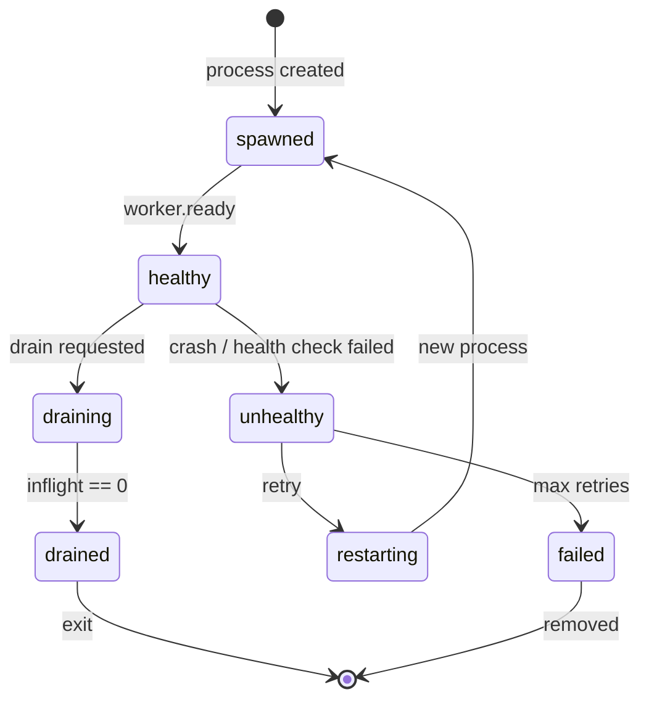

# L0 Worker


### Stateless, deterministic execution substrate for LLM inference.

> Receives commands from L1 orchestrator, executes tasks using the L0 runtime, and emits factual events back. No queue. No internal state. No opinions.

```
   L1 Orchestrator                L0 Worker                       LLM Provider
 ─────────────────    ┌──────────────────────────────────┐    ─────────────────
                      │                                  │
   TASK_SUBMIT ──────▶│  Slot Check · Auth · Execute     │──────▶ OpenAI
                      │  Retry · Fallback · Guardrails   │
   ◀── SSE Events ◀──│  Timeout · Resume · Abort        │◀── Stream Tokens
                      │                                  │
                      └──────────────────────────────────┘
                              L0 Runtime Inside
```

## Features

| Feature | Description |
|---------|-------------|
| **🔁 Retry + Fallback** | Smart retries with exponential backoff, sequential model fallbacks on error/timeout |
| **⚡ Parallel Execution** | Race (first wins) or fanout (all run) across multiple models simultaneously |
| **🛡️ Guardrails** | Streaming output validation via presets: `minimal`, `recommended`, `strict`, `json-only`, `markdown-only`, `latex-only` |
| **⏱️ Timeouts** | Per-stream `initialToken` and `interToken` timeouts — critical for serverless cost control |
| **📍 Token Resumption** | Resume from last checkpoint on retry/fallback instead of restarting from scratch |
| **🔧 Tool Definitions** | Schema-only tools passed to the model; tool call arguments captured and emitted as events |
| **🔇 Backpressure by Silence** | No slot = no `TASK_ACCEPTED` = L1 infers rejection. No queue, no buffering |
| **🔁 Deterministic Replay** | Re-emit recorded events byte-for-byte without re-execution |
| **🚨 Abort on Drain** | In-flight streams cancelled via `AbortSignal` when function timeout approaches |
| **📡 Full Observability** | Every L0 event (retry, fallback, guardrail, timeout, tool, checkpoint) forwarded to L1 via SSE |

## Stack

| Layer | Technology |
|-------|-----------|
| **Runtime** | Bun / Node.js + TypeScript |
| **Inference** | [`@ai2070/l0`](./l0/) — streaming runtime with retry, fallbacks, guardrails |
| **Providers** | `ai` + `@ai-sdk/openai` (OpenAI only) |
| **Validation** | Zod |
| **Deployment** | Bun standalone server or Vercel Serverless Functions |
| **Supervisor** | Rust process pool with health checks and crash recovery |

## Quick Start

```bash
npm install

# Standalone Bun server (port 3000)
npm run dev

# Vercel local dev
npm run dev:vercel

# Type check / Build
npm run lint && npm run build
```

Submit a task:

```bash
curl -X POST http://localhost:3000/api/submit \
  -H "Content-Type: application/json" \
  -d '{
    "type": "TASK_SUBMIT",
    "auth": { "token": "...", "issued_at": 1702900000000, "ttl": 30000 },
    "task_id": "task-123",
    "order": {
      "execution": {
        "models": [{ "provider": "openai", "model": "gpt-4o" }],
        "timeout": { "initialTokenMs": 10000 },
        "guardrails": { "preset": "recommended" }
      },
      "output": { "kind": "text" }
    },
    "payload": { "prompt": "Hello, world!" },
    "input_hash": "sha256:...",
    "submission_ts": 1702900000000
  }'
```

Response (SSE stream):

```
data: {"type":"TASK_ACCEPTED","taskId":"task-123","workerId":"...","ts":...}
data: {"type":"TASK_PROGRESS","taskId":"task-123","stage":"first_token","ts":...}
data: {"type":"TASK_COMPLETED","taskId":"task-123","output":"Hello!","outputHash":"sha256:...","finalMetrics":{...},"ts":...}
data: [DONE]
```

---

## Inference Order

Every task requires an `order` defining what to execute and what shape the result must have.

### Minimal

```json
{
  "execution": {
    "models": [{ "provider": "openai", "model": "gpt-4o" }]
  },
  "output": { "kind": "text" }
}
```

### Full

```json
{
  "execution": {
    "models": [
      { "provider": "openai", "model": "gpt-4o", "params": { "temperature": 0.7 } }
    ],
    "retry": { "attempts": 3, "maxRetries": 6, "backoff": "exponential", "baseDelayMs": 1000 },
    "fallbacks": [
      { "when": "error", "model": { "provider": "openai", "model": "gpt-4o-mini" } }
    ],
    "timeout": { "initialTokenMs": 10000, "interTokenMs": 5000 },
    "guardrails": { "preset": "recommended", "checkIntervalMs": 500 },
    "tools": [
      {
        "name": "get_weather",
        "description": "Get current weather for a city",
        "schema": { "type": "object", "properties": { "city": { "type": "string" } }, "required": ["city"] }
      }
    ],
    "parallel": { "mode": "race" },
    "continueFromLastKnownGoodToken": true
  },
  "output": {
    "kind": "json",
    "schema": { "type": "object", "properties": { "name": { "type": "string" } } },
    "strict": true
  }
}
```

### Execution Options Reference

| Field | Description |
|-------|-------------|
| `models` | Ordered model preference list (required, min 1) |
| `retry` | Retry config: `attempts`, `maxRetries`, `backoff` (`fixed`/`linear`/`exponential`/`fixed-jitter`/`full-jitter`), `baseDelayMs`, `maxDelayMs` |
| `fallbacks` | Sequential fallback models triggered on `error`, `timeout`, or `output_violation` |
| `timeout.initialTokenMs` | Max ms to wait for first token |
| `timeout.interTokenMs` | Max ms between consecutive tokens |
| `guardrails.preset` | `minimal` \| `recommended` \| `strict` \| `json-only` \| `markdown-only` \| `latex-only` |
| `guardrails.checkIntervalMs` | How often to run guardrail checks during streaming |
| `tools[]` | Schema-only tool definitions (`name`, `description?`, `schema`). Model generates calls; worker captures them |
| `parallel.mode` | `race` (first model wins) or `fanout` (all run, results as JSON array) |
| `parallel.max` | Max concurrency for fanout mode |
| `continueFromLastKnownGoodToken` | Resume from last checkpoint on retry/fallback instead of restarting |

### Output Kinds

| Kind | Description |
|------|-------------|
| `text` | Raw text stream |
| `json` | Structured JSON with schema validation (`schema` + `strict` fields) |

---

## API Endpoints

| Method | Path | Description |
|--------|------|-------------|
| POST | `/api/submit` | Submit task, returns SSE event stream |
| POST | `/api/replay` | Re-emit recorded events (no re-execution) |
| GET | `/api/status` | Worker health and capacity |
| POST | `/api/config` | Hot-reload configuration (localhost: no auth) |
| POST | `/api/drain` | Graceful shutdown (localhost: no auth) |

See [API.md](./API.md) for full request/response schemas.

---

## Events

### Worker → L1

| Event | Description |
|-------|-------------|
| `TASK_ACCEPTED` | Slot acquired, execution starting |
| `TASK_PROGRESS` | Milestone: `first_token` or `tool_invoked` (with `metadata.toolName`) |
| `TASK_COMPLETED` | Success with `output`, `outputHash`, `finalMetrics` |
| `TASK_FAILED` | Failure with `failureClass` and `retryable` flag |
| `WORKER_READY` | Worker initialized |
| `WORKER_DRAINING` | Graceful shutdown in progress, in-flight streams aborted |

**Failure classes:** `timeout` `rate_limited` `context_length_exceeded` `invalid_input` `model_error` `network_error` `guardrail_violation` `aborted` `unknown`

### L0 Runtime Events (passthrough)

All L0 events are forwarded to L1 as-is:

| Category | Events |
|----------|--------|
| Session | `SESSION_START`, `SESSION_END` |
| Retry | `RETRY_START`, `RETRY_ATTEMPT`, `RETRY_END` |
| Fallback | `FALLBACK_START`, `FALLBACK_MODEL_SELECTED`, `FALLBACK_END` |
| Guardrail | `GUARDRAIL_PHASE_START`, `GUARDRAIL_PHASE_END` |
| Timeout | `TIMEOUT_START`, `TIMEOUT_RESET`, `TIMEOUT_TRIGGERED` |
| Network | `NETWORK_ERROR`, `NETWORK_RECOVERY`, `CONNECTION_DROPPED` |
| Tools | `TOOL_REQUESTED`, `TOOL_START`, `TOOL_RESULT`, `TOOL_COMPLETED` |
| Checkpoint | `CHECKPOINT_SAVED`, `RESUME_START` |

Full event reference in [API.md](./API.md#l0-lifecycle-events).

---

## Authentication

Ephemeral HMAC-SHA256 tokens. Generated by L1, validated once, never stored.

```
token = HMAC-SHA256(L0_AUTH_SECRET, "task_id|issued_at|ttl")  →  base64
```

- Freshness: `now - issued_at < ttl`
- Clock skew: 5-second tolerance
- Dev mode: If `L0_AUTH_SECRET` is unset, signature check is skipped

---

## Backpressure

```
TASK_SUBMIT → slot available? → TASK_ACCEPTED → execute
                    ↓ no
                 silence (L1 infers rejection)
```

No queue. No buffering. No rejection event. Duplicate `task_id` while in-flight → silence.

---

## Replay

Re-emits recorded events without re-execution. In-memory event store (lost on restart) with optional FIFO eviction.

Replay **never** regenerates tokens, re-invokes tools, fabricates events, or emits anything not originally recorded.

---

## Configuration

### Deployment Presets

Auto-detected from `DEPLOYMENT=vercel` or `VERCEL` env var:

| Setting | Local | Vercel |
|---------|-------|--------|
| `maxConcurrency` | 64 | 1 |
| `functionTimeoutMs` | 0 (disabled) | 60000 |
| `drainBufferMs` | 5000 | 5000 |
| `skipAuthValidation` | true | false |

### Environment Variables

| Variable | Description | Default |
|----------|-------------|---------|
| `WORKER_ID` | Worker identifier | uuidv7 |
| `PORT` | Standalone server port | 3000 |
| `MAX_CONCURRENCY` | Max concurrent tasks | preset |
| `FUNCTION_TIMEOUT_MS` | Serverless timeout ms (0 = disabled) | preset |
| `DRAIN_BUFFER_MS` | Buffer before timeout to emit WORKER_DRAINING | 5000 |
| `SKIP_AUTH_VALIDATION` | Skip HMAC auth | preset |
| `L0_AUTH_SECRET` | Shared HMAC secret (required in production) | — |
| `OPENAI_API_KEY` | OpenAI API key | — |

---

## Supervisor (Multi-Worker Pool)

Rust process supervisor with health checks, crash recovery, and graceful shutdown.

```bash
cd supervisor && cargo build --release

# Run 4 workers starting at port 3001
./target/release/l0-supervisor -w 4 -p 3001 ./path/to/l0-worker
```

### Features

- Process pool with automatic restart (exponential backoff)
- HTTP health checks via `/api/status`
- Hung worker detection → kill + restart
- Graceful drain via `/api/drain`
- Real-time SSE event stream at `/workers/events`

### Supervisor API

| Method | Path | Description |
|--------|------|-------------|
| GET | `/workers` | List all workers with health status |
| GET | `/workers/:id` | Single worker status |
| GET | `/workers/events` | SSE stream of pool lifecycle events |
| POST | `/workers/spawn` | Spawn new worker on next port |
| POST | `/workers/:id/drain` | Graceful shutdown |
| POST | `/workers/:id/kill` | Force kill |
| POST | `/workers/:id/restart` | Drain + spawn new on same port |

Worker states: `starting` → `healthy` → `draining` → `drained` | `unhealthy` → `restarting` | `failed`



### CLI Options

| Option | Description | Default |
|--------|-------------|---------|
| `-w, --workers` | Number of workers | CPU count |
| `-p, --base-port` | Starting port | 3001 |
| `--max-port` | Max port number | 49151 |
| `--api-port` | Supervisor API port | 9000 |
| `--health-interval` | Health check interval (ms) | 2000 |
| `--health-timeout` | Health check timeout (ms) | 2000 |
| `--restart-delay` | Initial restart delay (ms) | 500 |
| `--max-restart-delay` | Max restart delay (ms) | 30000 |
| `--max-failures` | Max consecutive failures | 5 |
| `--max-unhealthy-checks` | Max unhealthy checks before kill | 2 |
| `--shutdown-timeout` | Graceful shutdown timeout (ms) | 30000 |
| `--worker-binary` | Path to l0-worker binary | `./l0-worker` |
| `--log-level` | trace/debug/info/warn/error | info |

---

## Project Structure

```
l0-worker/
├── api/                    # Vercel API routes (submit, replay, status, config)
├── src/
│   ├── server.ts           # Standalone Bun server
│   ├── worker-instance.ts  # Worker class (slot mgmt, event emission, abort)
│   ├── config.ts           # Deployment presets & env var loading
│   ├── executor/           # L0 runtime integration, providers, tools, parallel
│   ├── inference/          # InferenceOrder schema (Zod)
│   ├── events/             # Inbound/outbound event schemas
│   ├── state/              # Worker state machine & runtime config
│   ├── store/              # In-memory event recording
│   ├── replay/             # Deterministic event replay
│   ├── auth/               # HMAC auth validation
│   └── utils/              # sha256, clock
├── supervisor/             # Rust process supervisor
│   └── src/                # main, pool, worker, health, api
└── package.json
```

## License

Apache-2.0
